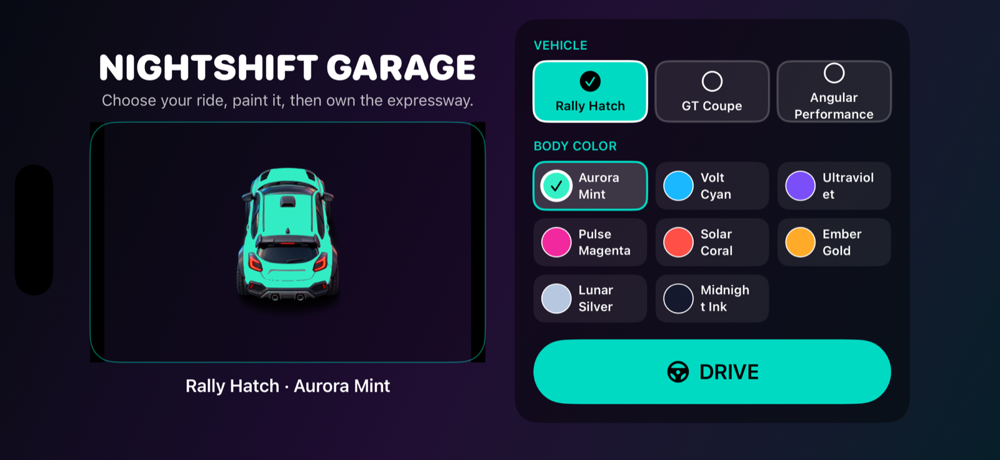
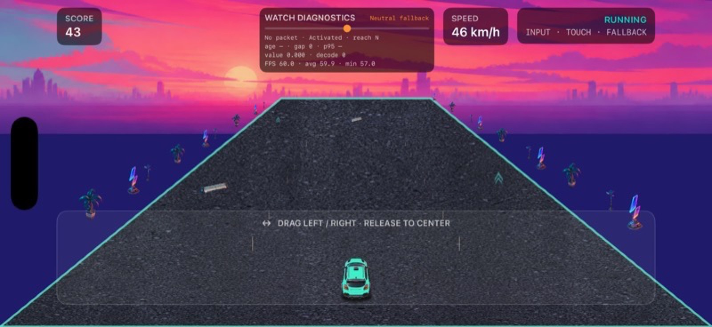
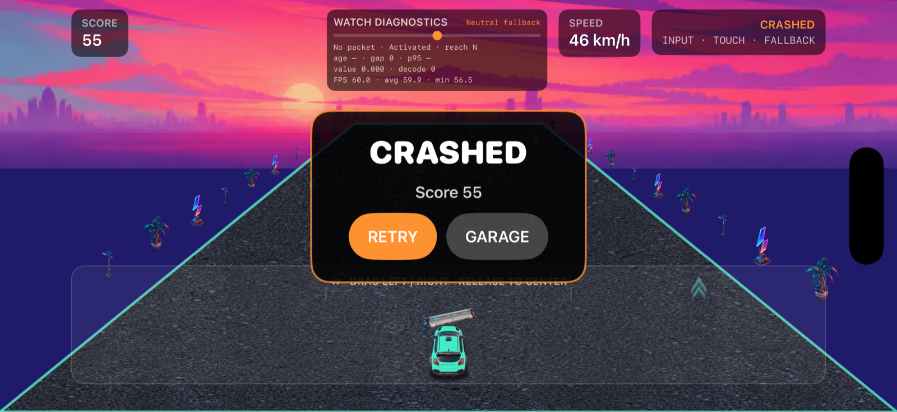
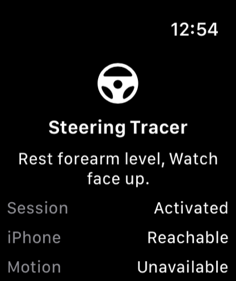

# Watch Car Racer

Apple Watch를 손목형 가상 운전대로 사용해 iPhone의 차량을 조향하는 네온 익스프레스웨이 러너입니다. Watch가 연결되지 않았을 때는 iPhone 화면을 좌우로 드래그해 그대로 플레이할 수 있습니다.

<p align="center">
  
</p>

## 주요 기능

- **Apple Watch 조향**: Watch를 중립 자세로 보정한 뒤 손목 움직임을 `-1...1` 조향값으로 변환해 iPhone으로 전송합니다.
- **안전한 터치 fallback**: Watch 입력이 오래되거나 연결이 끊기면 마지막 방향에 고정되지 않고 iPhone 드래그 조향으로 전환합니다.
- **24가지 차량 외형**: Rally Hatch, GT Coupe, Angular Performance 3종과 차체 색상 8종을 조합할 수 있습니다.
- **Nightshift Garage**: 앱을 실행할 때마다 차고에서 시작합니다. `DRIVE`한 선택은 저장되고 `RETRY`에서는 같은 차량·색상·seed가 유지됩니다.
- **PNG 기반 네온 아트**: 차량, 교통 차량, 장애물, 도로, 차선, 하늘과 길가 오브젝트를 원본 PNG texture로 렌더링합니다.
- **결정론적 게임 로직**: 자동 가속, 장애물 생성, 근접 회피, 점수와 충돌 판정을 렌더러와 분리된 seed 기반 시뮬레이션으로 처리합니다.
- **즉시 재도전**: 충돌 후 같은 run을 다시 시작하거나 `GARAGE`로 돌아가 다른 외형으로 새 run을 시작할 수 있습니다.

## 스크린샷

### 주행과 충돌

| 주행 | 충돌 후 선택 |
| --- | --- |
|  |  |
| 속도와 난이도가 올라가는 동안 교통 차량과 barrier를 회피합니다. | `RETRY`는 현재 외형과 seed를 유지하고 `GARAGE`는 새 run 선택 화면으로 돌아갑니다. |

### Apple Watch 조향 화면

<p align="center">
  
</p>

Watch 앱은 iPhone 연결 상태, motion 상태와 보정 여부를 표시합니다. 실기기에서는 팔을 편안하게 두고 Watch 화면을 위로 향한 상태에서 `Calibrate`한 뒤 손목을 좌우로 움직입니다. Watch Simulator에서는 motion 센서를 제공하지 않으므로 Debug 빌드의 `L / C / R` 합성 입력을 사용합니다.

## 플레이 흐름

1. 차고에서 차량과 차체 색상을 고릅니다.
2. asset 준비가 끝나면 `DRIVE`를 누릅니다.
3. Apple Watch를 보정해 손목으로 조향하거나 iPhone 화면을 좌우로 드래그합니다.
4. 느린 교통 차량과 도로 barrier를 피하며 점수를 올립니다.
5. 충돌하면 `RETRY`로 즉시 재시작하거나 `GARAGE`에서 외형을 바꿉니다.

## 요구 환경

- macOS와 Xcode 26.4에서 검증
- Swift 6
- iOS 18.0 이상, iPhone 전용 가로 화면
- watchOS 11.0 이상 Apple Watch 동반 앱
- 시뮬레이터만으로도 터치 fallback과 Watch 합성 입력 테스트 가능

## 시작하기

```sh
git clone https://github.com/dngur6344/watch-car-game.git
cd watch-car-game
open WatchCarRacer.xcodeproj
```

Xcode에서 `WatchCarRacer` scheme과 iPhone Simulator를 선택해 실행합니다. Watch 흐름을 확인하려면 해당 iPhone과 페어링된 Watch Simulator에서 `WatchCarRacerWatchApp` scheme도 실행합니다.

실기기에 설치할 때는 두 target의 Signing & Capabilities에서 자신의 Development Team을 선택해야 합니다. 별도 서버, API key 또는 환경 변수는 사용하지 않습니다.

## 테스트

아래 명령은 iOS/watchOS 26.4 Simulator runtime에서 검증했습니다. 다른 runtime을 설치했다면 destination의 기기명과 `OS` 값을 맞춰 변경합니다.

```sh
xcodebuild -project WatchCarRacer.xcodeproj \
  -scheme WatchCarRacer \
  -destination 'platform=iOS Simulator,name=iPhone 17 Pro Max,OS=26.4' \
  test

xcodebuild -project WatchCarRacer.xcodeproj \
  -scheme WatchCarRacerWatchApp \
  -destination 'platform=watchOS Simulator,name=Apple Watch Series 11 (46mm),OS=26.4' \
  test
```

Release build 확인:

```sh
xcodebuild -project WatchCarRacer.xcodeproj \
  -scheme WatchCarRacer -configuration Release \
  -destination 'platform=iOS Simulator,name=iPhone 17 Pro Max,OS=26.4' \
  build

xcodebuild -project WatchCarRacer.xcodeproj \
  -scheme WatchCarRacerWatchApp -configuration Release \
  -destination 'platform=watchOS Simulator,name=Apple Watch Series 11 (46mm),OS=26.4' \
  build
```

2026-08-25 최종 검증 결과:

- iOS 테스트 87/87, watchOS 테스트 11/11 통과
- iOS/watchOS Debug·Release 네 빌드 통과
- 300초 FPS 표본 평균 59.932, 최소 58, 연속 2회 50 미만 구간 없음
- compiled texture 21.11 MiB, 최대 atlas/background dimension 2048px
- 10회 차고↔게임 전환 후 RSS 약 355.6 MB → 356.3 MB, controller 10/10 해제

세부 acceptance 결과는 [구현 계획과 검증 기록](docs/2026-08-25-premium-assets-garage-customization/plan.md)에 정리되어 있습니다.

## 프로젝트 구조

```text
WatchCarRacer/
├── Shared/                 # iPhone·Watch 공유 packet 계약
├── iOS/
│   ├── App/                # 차고와 게임 route, SwiftUI shell
│   ├── Customization/      # 차량 catalog와 선택 저장
│   ├── Game/               # 결정론적 simulation과 SpriteKit renderer
│   ├── Input/              # Watch/touch 입력 routing
│   └── Resources/          # PNG atlas, background, asset manifest
└── Watch/
    ├── App/                # 보정 및 연결 상태 UI
    ├── Motion/             # 손목 자세 sampling과 steering mapping
    ├── Connectivity/       # WatchConnectivity 전송
    └── Feedback/           # Watch haptic

WatchCarRacerTests/         # iOS unit·flow·renderer tests
WatchCarRacerWatchTests/    # watchOS motion·transport tests
Scripts/                   # compiled texture memory 검사
docs/                      # 계획, provenance와 README screenshot
```

## 에셋과 접근성

- production PNG 19개는 [asset provenance](docs/assets/provenance.md)에 SHA-256과 제작 근거가 기록되어 있습니다.
- 차량·색상 선택은 label, selected trait, checkmark와 outline을 함께 사용해 색상만으로 상태를 전달하지 않습니다.
- Dynamic Type과 Reduce Motion 흐름을 Simulator에서 검증했습니다.
- VoiceOver 제스처 기반 전체 흐름과 Watch 조향 지연·손목 자세·햅틱·배터리 수명은 실제 iPhone/Apple Watch 후속 검증 항목입니다.
